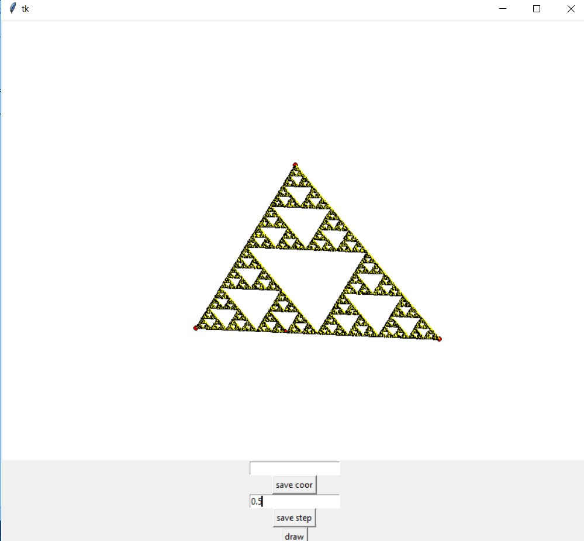
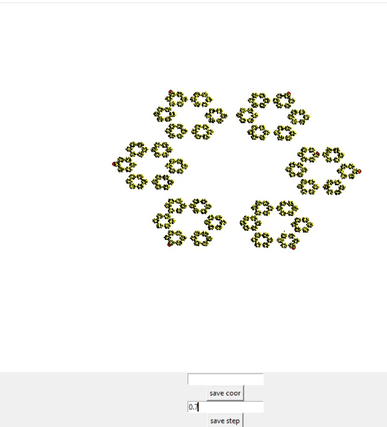
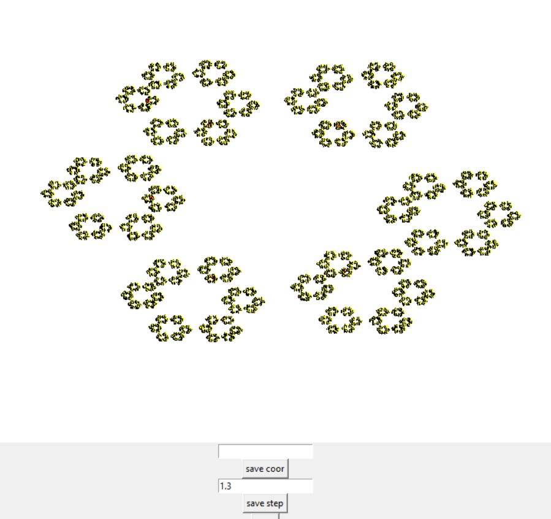
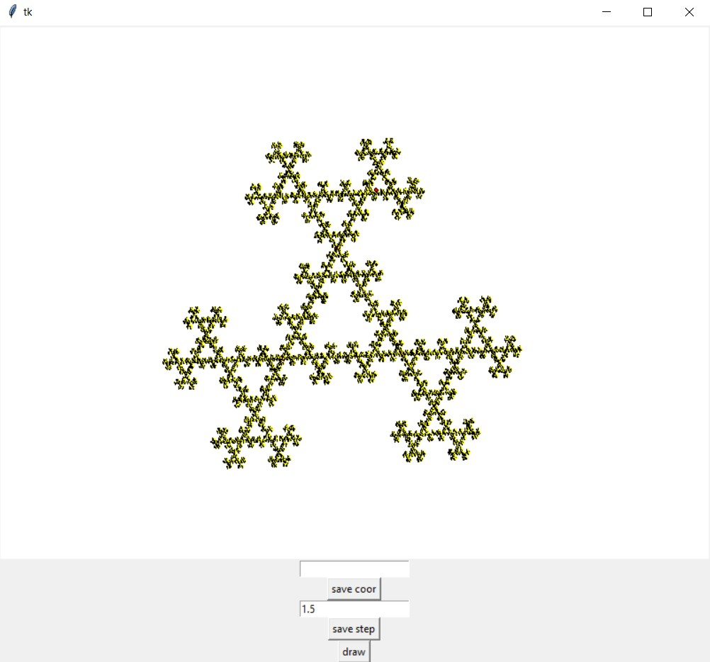

[ссылка (youtube)](https://www.youtube.com/watch?v=Nx3_nX8UoMo) на подробное объяснение идеи с которой была реализована программа

пользователь выбирает стартовые точки через прямое указание и в поле над кнопкой "save points"(координатами точек через пробел, каждая координата это 2 числа через пробел)
или отмечает нужные точки левой кнопкой мыши, обратите внимание нажатие на "save points" удаляет все предыдущие точки и заменяет их на новые, а нажатие ЛКМ на холсте добавляет новую точку

в поле над "save step" указывается коэффициент на который умножается расстояние между текущей и выбранной случайно точкой (для примера в видео он равен 0.5)

при нажатии на "draw" отрисовывается (дополнительно) 3000 точек

примеры:

1) как в видео(треугольник серпинского), треугольник и новая точка рисуется на середине отрезка

2) 6 точек с коэффициентом 0,7

изменение коэффициента на 1,3 "выворачивает" эту фигуру

3. 3 точки, но коэффициент 1,5

больше примеров можно посмотреть в папке data/fraktal_test
